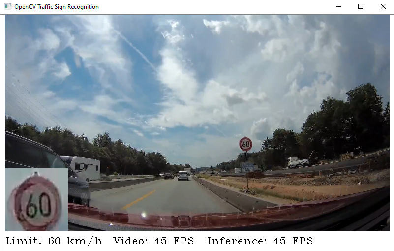

# German Traffic Sign Detection & Classification using OpenCV

Capstone project for the Udacity C++ Nanodegree, which implements real-time traffic sign detection and classification using OpenCV DNN. It can also work with [OpenVino](https://software.intel.com/en-us/openvino-toolkit) on supported hardware, f.ex. an Intel CPU, in order to speed up the inference.

Check out a **demo video** here: https://drive.google.com/open?id=1i8dOdehMpegX_rFVL2zex3DLS1eLs-Db. The program runs in real-time (up to 45FPS on my Intel i5) with CPU only, no GPU used. It could therefore be ported to an embedded System, f.ex. the Jetson Nano.

The system can detect eight different speed limits from the German [GTSRB](http://benchmark.ini.rub.de/?section=gtsrb&subsection=dataset) dataset:


It can run on both a USB webcam in real-time, or on a recorded video file:




For the detection part, I used a pretrained model of SSD_Mobilenet_V1 from [here](https://github.com/aarcosg/traffic-sign-detection). It was trained on the [GTSDB](http://benchmark.ini.rub.de/?section=gtsdb&subsection=dataset) dataset.  For the classification, I used my own model that I created for the SDC Nanodegree from [here](https://github.com/maxritter/SDC-Traffic-Sign-Recognition). 


**Requirements:**

- OpenCV >= 3.4 (4.x also works). Check out the installation guide [here](https://www.pyimagesearch.com/2018/05/28/ubuntu-18-04-how-to-install-opencv/).
- Boost >= 1.68.0. On Linux, install it with: `sudo apt-get install libboost-all-dev`
- Optional: OpenVino for speeding up the inference part (compile.sh needs to be adjusted to link the inference libraries from OpenVino, instead of OpenCV)
  

**Compilation:**

Use GCC to compile the program by running:

```
chmod +x compile.sh
./compile.sh
```

On Windows, you can also use the Visual Studio project to compile it.

**Usage:**

The program can be started with the -r option to record the GUI to a video inside the ./record folder (chunks of one minute), or with -v to use a video file. The camera ID can be changed in the helper.h file, it is zero by default.

You can download a sample video from [here](https://github.com/helloyide/real-time-German-traffic-sign-recognition/raw/master/src/testvideo/test1.mp4), then run the program with:

```
./traffic_sign -v <PATH_TO_YOUR_VIDEO>/test1.mp4
```

If you want to use your webcam, run the program without any additional parameter:

```
./traffic_sign
```


**Rubric Criteria:**

- Loops, Functions, I/O
  - The project demonstrates an understanding of C++ functions and control structures.
    - Used in the whole project
  - The project reads data from a file and process the data, or the program writes data to a file.
    - Reads video from file (helper::open_input_source in helper.h) or records video to file (video_recorder::_run in video_recorder.h)
  - The project accepts user input and processes the input.
    - Boost is used to parse command line arguments (main in main.cpp)
- Object Oriented Programming
  - The project uses Object Oriented Programming techniques.
    - Used in the whole project
  - Classes use appropriate access specifiers for class members.
    - Variables are declared as private whenever possible
  - Classes abstract implementation details from their interfaces.
    - Appropriate names are chosen and implementation details are hidden
  - Templates generalize functions in the project.
    - safe_queue is a template class
  - Classes encapsulate behavior.
    - Different classes are implemented (classificaton, detection, helper, safe_queue, video_recorder)
- Memory Management
  - The project makes use of references in function declarations.
    - For example detection::find_sign in detection.h
  - The project uses smart pointers instead of raw pointers.
    - Line 136 in main.cpp
- Concurrency
  - The project uses multithreading.
    - detection and video_recorder thread are implemented in a separate thread
  - A mutex or lock is used in the project.
    - safe_queue uses a lock_guard

